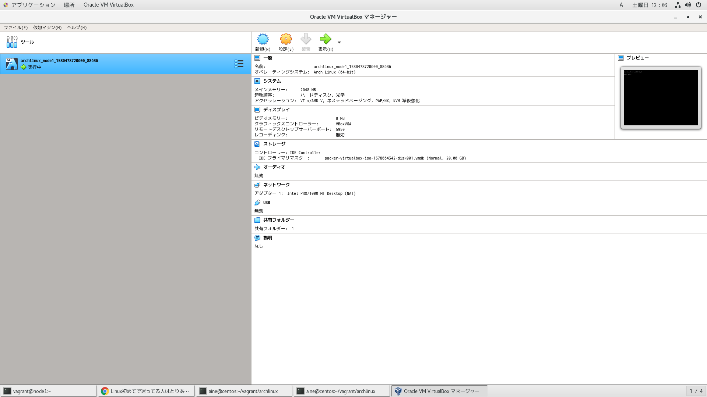

# SSHサーバー側（vagrantゲスト側）にxauthコマンドをインストール

```
[vagrant@node1 ~]$pacman -S xorg-xauth
```

# SSHサーバー設定ファイル

- 有効な設定を抽出する
```
[vagrant@node1 ~]$ grep -P '^[^#]' /etc/ssh/sshd_config
AuthorizedKeysFile	.ssh/authorized_keys
ChallengeResponseAuthentication no
UsePAM yes
X11Forwarding yes
X11DisplayOffset 10
X11UseLocalhost no
PrintMotd no # pam does that
Subsystem	sftp	/usr/lib/ssh/sftp-server
```
- X転送する上で重要な設定は以下
```
X11Forwarding yes
X11DisplayOffset 10
X11UseLocalhost no
```

# SSHプロセス再起動

設定ファイルを修正したら、再起動

```
[vagrant@node1 ~]$ sudo systemctl restart sshd
[vagrant@node1 ~]$ systemctl status sshd
● sshd.service - OpenSSH Daemon
     Loaded: loaded (/usr/lib/systemd/system/sshd.service; enabled; vendor preset: disabled)
     Active: active (running) since Sat 2020-02-01 10:42:56 JST; 1h 17min ago
   Main PID: 333 (sshd)
      Tasks: 1 (limit: 2370)
     Memory: 8.0M
     CGroup: /system.slice/sshd.service
             └─333 /usr/bin/sshd -D

Warning: Journal has been rotated since unit was started. Log output is incomplete or unavailable.
```

# SSH接続

- vagrantホスト側から接続

- -Xオプションを忘れない

```
aine@centos ~/vagrant$ssh vagrant@127.0.0.1 -p 2222 -i /home/aine/vagrant/archlinux/.vagrant/machines/node1/virtualbox/private_key -X
```

# DISPLAY環境変数の確認

- SSHでX転送有りの接続をする際、DISPLAY環境変数は端末ごとに自動で付番されるらしい

あるターミナル端末
```
[vagrant@node1 ~]$ tty
/dev/pts/1
[vagrant@node1 ~]$ echo $DISPLAY
node1:11.0
```

別のターミナル端末
```
[vagrant@node1 ~]$ tty
/dev/pts/2
[vagrant@node1 ~]$ echo $DISPLAY
node1:12.0
```

# トラシュー

- 事象
  - SSH接続できない
```
ssh: connect to host 127.0.0.1 port 2222: Connection refused
```

- 対策
  - 仮想マシンが起動しているか確認。起動していなければ、起動した後、接続。
```
aine@centos ~/vagrant/archlinux$vagrant status
aine@centos ~/vagrant/archlinux$vagrant up
aine@centos ~/vagrant/archlinux$ssh vagrant@127.0.0.1 -p 2222 -i /home/aine/vagrant/archlinux/.vagrant/machines/node1/virtualbox/private_key -X
```

- https://blog.livewing.net/install-arch-linux


環境構成がいい
- https://memo.laughk.org/2017/12/03/000013.html

# キーボード設定

- https://qiita.com/j8takagi/items/1ff632ce15d02b595718

デフォルトの状態
```
[vagrant@node1 ~]$ localectl
   System Locale: LANG=en_US.UTF-8
       VC Keymap: us
      X11 Layout: us
       X11 Model: pc105+inet
     X11 Options: terminate:ctrl_alt_bksp
```

利用可能なキー配列
```
[vagrant@node1 ~]$ localectl list-keymaps | grep jp
jp106
```

日本語キーボードに設定

```
[vagrant@node1 ~]$ sudo localectl set-keymap jp106
```

変更後の状態
```
[vagrant@node1 ~]$ localectl
   System Locale: LANG=en_US.UTF-8
       VC Keymap: jp106
      X11 Layout: jp
       X11 Model: jp106
     X11 Options: terminate:ctrl_alt_bksp
```

# ネットワーク設定

- vagrantホスト側からvirtualboxのツールを使って確認できる

```
aine@centos ~/vagrant/archlinux$virtualbox &
[1] 15586
```

これはVisualBoxのコマンドの一つへのリンクとなっている

```
aine@centos ~/vagrant/archlinux$ls -l /usr/bin/virtualbox
lrwxrwxrwx. 1 root root 4  1月 30 23:21 /usr/bin/virtualbox -> VBox
aine@centos ~/vagrant/archlinux$ls -l /usr/bin/VBox
-rwxr-xr-x. 1 root root 4677  1月 14  2019 /usr/bin/VBox
```




疎通確認

```
aine@centos ~/vagrant/archlinux$ip a show eno1
2: eno1: <BROADCAST,MULTICAST,UP,LOWER_UP> mtu 1500 qdisc pfifo_fast state UP group default qlen 1000
    link/ether 00:d8:61:2c:f1:5b brd ff:ff:ff:ff:ff:ff
    inet 192.168.1.109/24 brd 192.168.1.255 scope global noprefixroute eno1
       valid_lft forever preferred_lft forever
    inet6 fe80::96c8:b118:fafa:557f/64 scope link noprefixroute 
       valid_lft forever preferred_lft forever

aine@centos ~/vagrant/archlinux$ssh vagrant@127.0.0.1 -p 2222 -i /home/aine/vagrant/archlinux/.vagrant/machines/node1/virtualbox/private_key -X
Last login: Sat Feb  1 12:23:35 2020 from 10.0.2.2
[vagrant@node1 ~]$ ip a show
1: lo: <LOOPBACK,UP,LOWER_UP> mtu 65536 qdisc noqueue state UNKNOWN group default qlen 1000
    link/loopback 00:00:00:00:00:00 brd 00:00:00:00:00:00
    inet 127.0.0.1/8 scope host lo
       valid_lft forever preferred_lft forever
    inet6 ::1/128 scope host 
       valid_lft forever preferred_lft forever
2: eth0: <BROADCAST,MULTICAST,UP,LOWER_UP> mtu 1500 qdisc fq_codel state UP group default qlen 1000
    link/ether 08:00:27:56:95:23 brd ff:ff:ff:ff:ff:ff
    inet 10.0.2.15/24 brd 10.0.2.255 scope global dynamic eth0
       valid_lft 86021sec preferred_lft 86021sec
    inet6 fe80::a00:27ff:fe56:9523/64 scope link 
       valid_lft forever preferred_lft forever

[vagrant@node1 ~]$ ping -c3 192.168.1.109
PING 192.168.1.109 (192.168.1.109) 56(84) bytes of data.
64 bytes from 192.168.1.109: icmp_seq=1 ttl=63 time=2.53 ms
64 bytes from 192.168.1.109: icmp_seq=2 ttl=63 time=0.755 ms
64 bytes from 192.168.1.109: icmp_seq=3 ttl=63 time=0.729 ms

--- 192.168.1.109 ping statistics ---
3 packets transmitted, 3 received, 0% packet loss, time 2002ms
rtt min/avg/max/mdev = 0.729/1.338/2.531/0.843 ms
[vagrant@node1 ~]$ traceroute 192.168.1.109
traceroute to 192.168.1.109 (192.168.1.109), 30 hops max, 60 byte packets
 1  _gateway (10.0.2.2)  0.393 ms  0.382 ms  0.422 ms
 2  192.168.1.109 (192.168.1.109)  0.835 ms  0.589 ms  0.669 ms
[vagrant@node1 ~]$ ping -c3 8.8.8.8
PING 8.8.8.8 (8.8.8.8) 56(84) bytes of data.
64 bytes from 8.8.8.8: icmp_seq=1 ttl=63 time=6.51 ms
64 bytes from 8.8.8.8: icmp_seq=2 ttl=63 time=22.0 ms
64 bytes from 8.8.8.8: icmp_seq=3 ttl=63 time=10.0 ms

--- 8.8.8.8 ping statistics ---
3 packets transmitted, 3 received, 0% packet loss, time 2004ms
rtt min/avg/max/mdev = 6.513/12.853/21.999/6.626 ms
[vagrant@node1 ~]$ traceroute 8.8.8.8
traceroute to 8.8.8.8 (8.8.8.8), 30 hops max, 60 byte packets
 1  _gateway (10.0.2.2)  0.786 ms  0.350 ms  0.215 ms
 2  192.168.1.1 (192.168.1.1)  1.523 ms  1.487 ms  1.283 ms
 3  210.153.251.235 (210.153.251.235)  4.790 ms  5.823 ms  5.669 ms
 4  210.139.125.169 (210.139.125.169)  5.616 ms  5.565 ms  5.640 ms
 5  210.165.249.177 (210.165.249.177)  6.254 ms  6.219 ms  6.071 ms
 6  210.165.249.181 (210.165.249.181)  6.019 ms  5.812 ms  8.795 ms
 7  p254--504.tky-nk-acr02.sphere.ad.jp (210.153.241.113)  10.776 ms  8.691 ms  8.584 ms
 8  0-0-1-0--2026.tky-t4-bdr02.sphere.ad.jp (202.239.117.46)  9.354 ms  9.227 ms  23.233 ms
 9  72.14.205.32 (72.14.205.32)  22.664 ms  22.632 ms 210.150.215.242 (210.150.215.242)  29.486 ms
10  * * *
11  209.85.242.45 (209.85.242.45)  24.814 ms 209.85.248.113 (209.85.248.113)  24.763 ms dns.google (8.8.8.8)  24.632 ms
```


# libvirtプロセス管理下の仮想マシンを作成

vagrantツール経由で

```
aine@centos ~/vagrant/kvm/archlinux$vagrant init archlinux/archlinux
`Vagrantfile` already exists in this directory. Remove it before
running `vagrant init`.
aine@centos ~/vagrant/kvm/archlinux$mv Vagrantfile Vagrantfile-old
aine@centos ~/vagrant/kvm/archlinux$vagrant init archlinux/archlinux
A `Vagrantfile` has been placed in this directory. You are now
ready to `vagrant up` your first virtual environment! Please read
the comments in the Vagrantfile as well as documentation on
`vagrantup.com` for more information on using Vagrant.
aine@centos ~/vagrant/kvm/archlinux$ls
1.png  Vagrantfile  Vagrantfile-old  devenv.sh  log  manual.md
aine@centos ~/vagrant/kvm/archlinux$vi Vagrantfile
```

```
aine@centos ~/vagrant/kvm/archlinux$vagrant up --provider=libvirt

```
