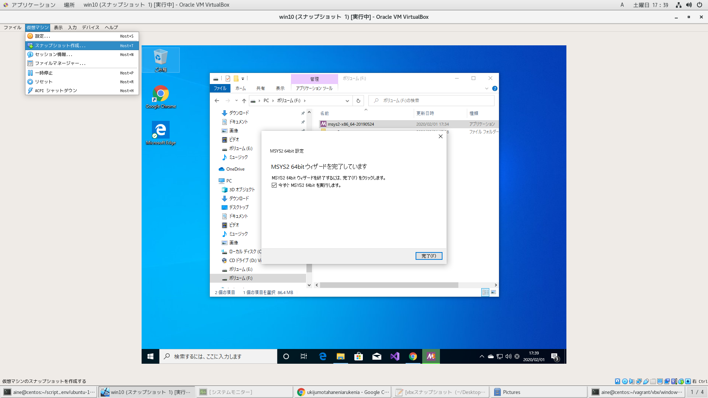

# 参考文献

win10の環境構築参考になる

- http://wakita.github.io/gldojo/sb0/msys2/

- https://qiita.com/hinataysi29734/items/d4e48ca673bad2f5ea03

# virtualboxコマンドで設定

vagrantホスト側でvirtualboxコマンドをバッググラウンド起動

```
$virtualbox &
```

このコマンド経由による仮想マシンに対する設定内容をファイル出力したい。

Vagrantfileに落とし込めれば、自動化できる。

スナップショットにすることができた。



```
$cd ~/VirtualBox VMs/win10/Snapshots
$ll -lh
合計 2.2G
-rw-------. 1 aine aine 2.1G  2月  1 17:06 2020-02-01T08-05-45-190378000Z.sav
-rw-------. 1 aine aine  85M  2月  1 17:06 {b7a01cc9-e975-42b6-a125-b9ba32842747}.vhd
```

# isoファイルを移動

ここからダウンロード
- https://www.microsoft.com/ja-jp/software-download/windows10ISO

プロダクトキーはwin7のやつを利用できるらしい

```
$cp ~/Downloads/Win10_1909_Japanese_x64.iso ~/VirtualBox VMs/win10
$cd ~/VirtualBox VMs/win10
$ll
合計 5250564
-rw-rw-r--. 1 aine aine 5376456704  2月  1 13:54 Win10_1909_Japanese_x64.iso
-rw-------. 1 aine aine       2281  2月  1 13:51 win10.vbox
-rw-------. 1 aine aine       1792  2月  1 13:51 win10.vbox-prev
-rw-------. 1 aine aine     104448  2月  1 13:51 win10.vhd
```

# フルスクリーン表示

- http://exlight.net/linux/vbox_guest_additions/

```
$locate VBoxGuestAdditions.iso
/usr/share/virtualbox/VBoxGuestAdditions.iso
```

# 仮想マシンのメモリ・CPU

|key|value|
|:-:|:-:|
|メモリ|20MB|
|ＣＰＵ|6CORE|
|ディスク|200GB|

# WSLのインストール

- VisualBox上のwin10では安定しない

# MSYS2のインストール

- https://www.msys2.org/
  - msys2-x86_64-20190524.exeをクリック
  - OSはArchLinuxとなる

## 参考文献

- https://text.baldanders.info/remark/2016/03/gcc-msys2-1/
- https://text.baldanders.info/remark/2016/03/gcc-msys2-2/
- https://qiita.com/TsutomuNakamura/items/b60518f8788e5e998744
- http://flow-developers.hatenablog.com/entry/2018/05/15/234918
- https://nagayasu-shinya.com/msys2-pacman-db-update-err/
- https://qiita.com/k-takata/items/fcb2f1f9ca564fd78597
- https://qiita.com/k-takata/items/373ec7f23d5d7541f982
- https://qiita.com/tukiyo3/items/4ac825c5f34ec88c405f
- https://qiita.com/yuukiyouki/items/a84c14240429e453428b
- https://qiita.com/Ted-HM/items/4f2feb9fdacb6c72083c
- https://qiita.com/MoriokaReimen/items/dbe1448ce6c0f80a6ac1

## rootユーザーの設定


## プロキシの設定

あれば

F:\msys2\etc\profile.d\proxy.shを作成
```
cat <<EOS >F:\msys2\etc\profile.d\proxy.sh
export http_proxy=http://proxyserver.domain:port
export HTTP_PROXY=http://proxyserver.domain:port
export https_proxy=https://proxyserver.domain:port
export HTTPS_PROXY=https://proxyserver.domain:port
export no_proxy="localhost,127.0.0.1"
export NO_PROXY="localhost,127.0.0.1"
EOS
```

## 共有フォルダの設定

VisualBox上のWin10システムとMSYS2システムで共有するフォルダを指定

よく使いそうなフォルダをマウントしておく

F:\msys2\etc\fstabに追記
追記後、再起動
```
# For a description of the file format, see the Users Guide
# http://cygwin.com/cygwin-ug-net/using.html#mount-table

# DO NOT REMOVE NEXT LINE. It remove cygdrive prefix from path
none / cygdrive binary,posix=0,noacl,user 0 0

F:\script-scratch /script-scratch
F:\script-env /script-env
```

## レポジトリの登録

```
echo 'Server = https://mirrors.kernel.org/archlinux/community/os/$arch' >/etc/pacman.d/mirrorlist-community
echo 'Server = https://mirrors.kernel.org/archlinux/core/os/$arch' >/etc/pacman.d/mirrorlist-core
echo 'Server = https://mirrors.kernel.org/archlinux/extra/os/$arch' >/etc/pacman.d/mirrorlist-extra
echo 'Server = https://mirrors.kernel.org/archlinux/multilib/os/$arch' >/etc/pacman.d/mirrorlist-multilib
```

```
cat <<EOS >>/etc/pacman.conf
[community]
Include = /etc/pacman.d/mirrorlist-community
[core]
Include = /etc/pacman.d/mirrorlist-core
[extra]
Include = /etc/pacman.d/mirrorlist-extra
[multilib]
Include = /etc/pacman.d/mirrorlist-multilib
EOS
```

## wget有効化

F:\msys2\etc\pacman.conf

- 変更前

```
#XferCommand = /usr/bin/curl -C - -f %u > %o
#XferCommand = /usr/bin/wget --passive-ftp -c -O %o %u
```

- 変更後

```
#XferCommand = /usr/bin/curl -C - -f %u > %o
XferCommand = /usr/bin/wget --passive-ftp -c -O %o %u
```

## 信頼できる公開鍵のインストールのため、一度だけ穴あける

作業進まないので、しょうがない

F:\msys2\etc\pacman.conf

- 変更前
```
SigLevel = Required DatabaseOptional
```

- 変更後
```
SigLevel = Never
```

- 公開鍵をインストール

```
$pacman -S archlinux-keyring
```

- 変更前に戻す

次回の鍵更新でも同じ手順で実施

```
SigLevel = Required DatabaseOptional
```

## パッケージのインストールとアップデート

以下のコマンドを実行するとハングアップするので、ターミナルを切断し、再度実行して更新対象がなくなることを確認
```
$pacman -Syuu
```


# VisualStudioのインストール

ここからダウンロード
- https://visualstudio.microsoft.com/ja/thank-you-downloading-visual-studio/?sku=Community&rel=16

インストーラーで参照できるように、予めkeyに記載のフォルダを作成しておく

アプリ起動する際はvs-scratchフォルダをマウントして使用

|key|value|
|:-:|:-:|
|vs-edit|実行ファイル|
|vs-tool|実行ファイルに伴うライブラリ群|
|vs-repo|ダウンロードしたソフト|
|vs-scratch|作成したスクリプト|
